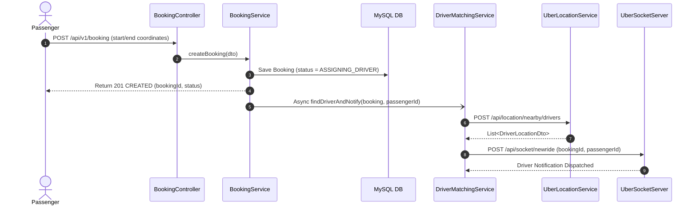

# 🚗 UberBookingService

**UberBookingService** is a core microservice in the Uber backend ecosystem responsible for orchestrating ride bookings, matching passengers with nearby drivers, handling concurrency during ride acceptance, and integrating with other microservices via Eureka Service Discovery, Retrofit HTTP clients, and Apache Kafka event streaming.

---

## 📌 Table of Contents
- [Architecture Overview](#-architecture-overview)
- [Key Features](#-key-features)
- [Tech Stack](#-tech-stack)
- [System Interaction Flow](#-system-interaction-flow)
- [API Endpoints](#-api-endpoints)
- [Configuration & Environment](#-configuration--environment)
- [Getting Started](#-getting-started)
  - [Prerequisites](#prerequisites)
  - [Installation & Setup](#installation--setup)
  - [Running the Application](#running-the-application)
- [Project Structure](#-project-structure)
- [Exception Handling & Concurrency](#-exception-handling--concurrency)
- [Future Roadmap](#-future-roadmap)

---

## 🏗 Architecture Overview

```
                      +-----------------------------+
                      |   Eureka Discovery Server   |
                      |    (localhost:8761/eureka)  |
                      +--------------+--------------+
                                     ^
                                     | (Service Lookup & Registration)
                                     v
+------------------+         +-------------------------------+         +----------------------------+
|  Passenger / UI  | ======> |      UberBookingService       | ======> |  UberLocationService       |
|  (HTTP Client)   |  REST   |         (Port: 8000)          | Retrofit|  (Nearby Driver Search)    |
+------------------+         +---------------+---------------+         +----------------------------+
                                     |               |
                                     | Retrofit      | Kafka (Events)
                                     v               v
                      +------------------------+  +-------------------------+
                      |    UberSocketServer    |  |    Apache Kafka         |
                      |   (Driver WebSockets)  |  |    (localhost:9092)     |
                      +------------------------+  +-------------------------+
                                     |
                                     v
                              [ MySQL Database ]
                             (Uber_Db_local:3306)
```

UberBookingService coordinates with multiple components:
- **Eureka Server:** Service registry for dynamic microservice endpoint resolution.
- **UberLocationService:** Geospatial microservice queried via Retrofit to locate nearby available drivers based on pickup latitude and longitude.
- **UberSocketServer:** Real-time communication service alerted via Retrofit to push ride requests to matching drivers.
- **Apache Kafka:** Event broker handling decoupled event publishing and multi-consumer group subscription.
- **MySQL Database:** Relational database storing bookings, passengers, drivers, and audit data with optimistic concurrency control.

---

## ✨ Key Features

- **Ride Booking Lifecycle Management:** Handles booking creation, driver assignment, status transitions (`ASSIGNING_DRIVER` $\rightarrow$ `SCHEDULED`), and ride updates.
- **Asynchronous Driver Matching:** Leverages dedicated thread pools (`ThreadPoolTaskExecutor`) and `@Async` processing so booking requests return immediately to the passenger without blocking.
- **Dynamic Microservice Communication:** Uses Retrofit2 paired with Netflix Eureka to discover and invoke downstream services dynamically.
- **Optimistic Locking & Concurrency Control:** Safeguards against race conditions when multiple drivers attempt to accept the same booking simultaneously (`ObjectOptimisticLockingFailureException`).
- **Kafka Event Streaming:** Configured with custom producers, consumer factories, and consumer groups (`sample-group-2`, `sample-group-3`) for real-time messaging.
- **Centralized Error Handling:** Global exception handling returning uniform JSON error responses with detailed error codes and timestamps.
- **Shared Entity Library:** Integrates `UberProject-EntityService` for consistent entity models across microservices.

---

## 🛠 Tech Stack

| Category | Technology / Library |
|---|---|
| **Language** | Java 21 |
| **Framework** | Spring Boot 4.0.1 |
| **Build Tool** | Gradle |
| **Service Discovery** | Spring Cloud Netflix Eureka Client 5.0.0 |
| **HTTP Client** | Square Retrofit 2.4.0 + OkHttp + Gson Converter |
| **Messaging** | Apache Kafka (`spring-boot-starter-kafka`) |
| **Persistence & ORM** | Spring Data JPA / Hibernate, MySQL Connector/J |
| **Utilities** | Project Lombok |

---

## 🔄 System Interaction Flow

### 1. Booking Creation & Driver Notification


### 2. Driver Acceptance

```mermaid
sequenceDiagram
    autonumber
    actor Driver
    participant BookingController
    participant BookingService
    participant DB as MySQL DB

    Driver->>BookingController: POST /api/v1/booking/{bookingId} (driverId)
    BookingController->>BookingService: updateBooking(dto, bookingId)
    BookingService->>DB: Fetch Driver & Booking
    alt Ride already accepted or Driver unavailable
        BookingService-->>Driver: 400 Bad Request / 409 Conflict
    else Ride available
        BookingService->>DB: Update Booking (status = SCHEDULED, driver = driver)
        BookingService-->>Driver: 200 OK (bookingId, status, driver details)
    end
```


---

## 📡 API Endpoints

### Base URL: `/api/v1/booking`

#### 1. Create a New Booking
- **Method:** `POST`
- **Path:** `/api/v1/booking`
- **Description:** Initializes a new ride request and triggers asynchronous driver matching.
- **Request Body:**
```json
{
  "passengerId": 1,
  "startLocation": {
    "latitude": 12.971598,
    "longitude": 77.594566
  },
  "endLocation": {
    "latitude": 12.935242,
    "longitude": 77.624462
  }
}
```
- **Response (`201 Created`):**
```json
{
  "bookingId": 101,
  "bookingStatus": "ASSIGNING_DRIVER",
  "driver": null
}
```

---

#### 2. Update / Accept a Booking
- **Method:** `POST`
- **Path:** `/api/v1/booking/{bookingId}`
- **Description:** Updates the booking status (e.g., driver accepts the ride).
- **Request Body:**
```json
{
  "status": "SCHEDULED",
  "driverId": 5
}
```
- **Response (`200 OK`):**
```json
{
  "bookingId": 101,
  "status": "SCHEDULED",
  "driver": {
    "id": 5,
    "name": "John Doe",
    "isAvailable": true
  }
}
```

---

## ⚙️ Configuration & Environment

Configuration is maintained in [`src/main/resources/application.properties`](src/main/resources/application.properties):

```properties
spring.application.name=UberBookingService
server.port=8000

# Database Configuration
spring.datasource.url=jdbc:mysql://localhost:3306/Uber_Db_local
spring.datasource.username=root
spring.datasource.password=${mysql_password}
spring.jpa.show-sql=true
spring.jpa.hibernate.ddl-auto=validate

# Eureka Discovery Configuration
eureka.client.service-url.defaultZone=http://localhost:8761/eureka
eureka.instance.preferIpAddress=true

# Kafka Configuration
spring.kafka.bootstrap-servers=localhost:9092
spring.kafka.producer.key-serializer=org.apache.kafka.common.serialization.StringSerializer
spring.kafka.producer.value-serializer=org.apache.kafka.common.serialization.StringSerializer
spring.kafka.consumer.key-deserializer=org.apache.kafka.common.serialization.StringDeserializer
spring.kafka.consumer.value-deserializer=org.apache.kafka.common.serialization.StringDeserializer
spring.kafka.consumer.group-id=sample-group-2
spring.kafka.consumer.auto-offset-reset=earliest
```

> **Note:** Set the `mysql_password` environment variable or JVM argument prior to starting the service.

---

## 🚀 Getting Started

### Prerequisites
- **JDK 21** or later installed
- **MySQL Server** (database `Uber_Db_local` created)
- **Apache Kafka** running at `localhost:9092`
- **Netflix Eureka Server** running at `http://localhost:8761`
- **UberProject-EntityService** installed in local Maven repository (`~/.m2/repository`)

### Installation & Setup

1. **Clone the repository:**
   ```bash
   git clone https://github.com/MukulVerma14/UberProject-BookingService.git
   cd UberProject-BookingService
   ```

2. **Ensure EntityService is available locally:**
   Make sure the dependency `com.example:UberProject-EntityService:0.0.9-SNAPSHOT` is published to Maven Local (`mavenLocal()`).

3. **Set environment variables:**
   - On Windows (PowerShell):
     ```powershell
     $env:mysql_password="your_mysql_password"
     ```
   - On Linux/macOS:
     ```bash
     export mysql_password="your_mysql_password"
     ```

### Running the Application

- **Using Gradle Wrapper:**
  - On Windows:
    ```cmd
    .\gradlew.bat bootRun
    ```
  - On Linux/macOS:
    ```bash
    ./gradlew bootRun
    ```

- **Building the JAR:**
  ```bash
  ./gradlew build -x test
  java -jar build/libs/UberBookingService-0.0.1-SNAPSHOT.jar
  ```

---

## 📂 Project Structure

```
UberBookingService/
├── src/
│   ├── main/
│   │   ├── java/com/example/uberbookingservice/
│   │   │   ├── UberBookingServiceApplication.java   # Spring Boot Main Application
│   │   │   ├── apis/                                # Retrofit API Declarations
│   │   │   │   ├── LocationServiceApi.java          # Retrofit interface for UberLocationService
│   │   │   │   └── UberSocketApi.java               # Retrofit interface for UberSocketServer
│   │   │   ├── Configuration/                       # Infrastructure Configs
│   │   │   │   ├── AsyncConfig.java                 # Custom ThreadPoolTaskExecutor configuration
│   │   │   │   └── KafkaConfig.java                 # Kafka Producer/Consumer Bean Definitions
│   │   │   ├── Consumers/                           # Kafka Event Consumers
│   │   │   │   ├── KafkaConsumerService.java        # Listener on sample-topic (sample-group-2)
│   │   │   │   └── KafkaConsumerService1.java       # Listener on sample-topic (sample-group-3)
│   │   │   ├── controllers/                         # REST Controllers & Retrofit Clients
│   │   │   │   ├── BookingController.java           # Endpoints for booking creation and updates
│   │   │   │   └── RetrofitConfig.java              # Dynamic Eureka-integrated Retrofit Beans
│   │   │   ├── dto/                                 # Data Transfer Objects
│   │   │   │   ├── CreateBookingDto.java
│   │   │   │   ├── CreateBookingResponseDto.java
│   │   │   │   ├── DriverLocationDto.java
│   │   │   │   ├── ErrorResponseDto.java
│   │   │   │   ├── NearByDriversRequestDto.java
│   │   │   │   ├── RideRequestDto.java
│   │   │   │   ├── UpdateBookingRequestDto.java
│   │   │   │   └── UpdateBookingResponseDto.java
│   │   │   ├── exceptions/                          # Global Error Handling
│   │   │   │   └── GlobalExceptionHandler.java      # @ControllerAdvice for conflicts & logic errors
│   │   │   ├── repositories/                        # Spring Data JPA Repositories
│   │   │   │   ├── BookingRepository.java
│   │   │   │   ├── DriverRepository.java
│   │   │   │   └── PassengerRepository.java
│   │   │   └── services/                            # Core Business Logic
│   │   │       ├── BookingService.java              # Booking Service Interface
│   │   │       ├── BookingServiceImpl.java          # Booking Service Implementation
│   │   │       └── DriverMatchingService.java       # Asynchronous Driver Matching & Socket Dispatch
│   │   └── resources/
│   │       └── application.properties               # Application Configuration Properties
│   └── test/                                        # Unit and Integration Tests
├── build.gradle                                     # Gradle Dependencies and Build Script
├── settings.gradle
└── README.md
```

---

## 🛡 Concurrency & Exception Handling

- **Optimistic Locking (`ObjectOptimisticLockingFailureException`):**
  When two drivers attempt to claim the exact same booking at identical moments, Hibernate's versioning kicks in. The `GlobalExceptionHandler` intercepts the conflict and responds with:
  ```json
  {
    "message": "This ride has already been accepted by another driver. Better luck next time!",
    "errorCode": "RIDE_ALREADY_TAKEN",
    "timestamp": "2026-08-31T20:45:00"
  }
  ```
  with HTTP Status `409 CONFLICT`.

- **Business Logic Errors (`RuntimeException`):**
  Returns HTTP Status `400 BAD_REQUEST` with error code `BUSSINESS_LOGIC_ERROR`.

---

## 🗺 Future Improvements

- [ ] Add OTP verification flow for ride start and completion.
- [ ] Implement Circuit Breakers (Resilience4j) on Retrofit calls to Location and Socket services.
- [ ] Expand Kafka event publishers to emit lifecycle events (`BookingCreatedEvent`, `BookingAcceptedEvent`, `RideCompletedEvent`).
- [ ] Integrate Distributed Tracing with Spring Cloud Sleuth / Micrometer and Zipkin.
